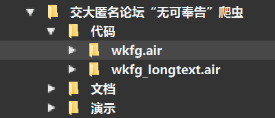

# wkfg-spider
上海交通大学匿名论坛爬虫

## 序、概述

第一部分介绍用法；之后几个部分介绍开发方法。

## 一、使用方法

[^1]: 参考知乎文章https://zhuanlan.zhihu.com/p/55266133

### 0、安装Airtest

从Airtest官网：[https://airtest.netease.com](https://airtest.netease.com)下载Airtest。Airtest已经打包好了开发需要的全部环境，下载完毕后在文件夹中找到AirtestIDE.exe双击运行。

Airtest运行以后的界面如下图所示。


### 1、连接手机

以Android手机为例。Airtest会通过adb命令安装两个辅助App到手机上，再用adb命令通过控制这两个辅助App进而控制手机，因此首先需要确保手机的`adb调试`功能是打开的，并允许通过adb命令安装App到手机上。

启动Airtest以后，把Android手机连接到电脑上，点击下图方框中的`刷新 ADB`：


此时在Airtest界面右上角应该能够看到手机的信息，如下图所示。


点击`connect`按钮，此时可以在界面上看到手机的界面，并且当你手动操作手机屏幕时，Airtest中的手机画面实时更新。如下图所示。注意需要保证无可奉告App在当前界面。


对于某些手机，例如小米，在第一次使用Airtest时，请注意手机上将会弹出提示，询问你是否允许安装App，此时需要点击允许按钮。

### 2、打开.air文件

点击左上角文件——打开脚本：




点击需要使用的air文件，即可在脚本编辑窗看到相应的代码。


### 3、修改参数

#### wkfg_batch

在main函数中按注释提示修改begin_id和end_id。注意end_id比实际爬到的帖子多1。以爬取第2003到第2004个帖子为例，点击上方横置三角形运行按钮。程序启动，等待其执行完毕即可在同目录下查看爬取的文本。

<video src="images\20210402_201323.mp4" />

以下是视频所示部分的记录：


#### wkfg_select

按照提示在列表中写入帖子ID，以爬取#000158，#024582，#019327为例：


点击运行即可。后续同上。

#### wkfg_longtext

模式类似于wkfg_batch，写上起止ID即可。如爬取长文本#004191，需要令begin_id=4191，end_id=4192：


这个模式会比较慢，而且因为测试用例少，可能会有未知bug。


## 二、框架和库

### 自动化测试框架AirtestProject

[^2]: 官方教程https://airtest.doc.io.netease.com/tutorial/

AirtestProject是一款基于Python的、跨平台的UI自动化测试框架，基于图像识别原理，适用于游戏和App。

在下载解压Airtest脚本的专属IDE——AirtestIDE后，点击“新建脚本”按钮，默认即可创建一个后缀名为`.air`的脚本文件，`.air`这是Airtest脚本的专属后缀。AirtestIDE是跨平台的**UI自动化测试编辑器**，内置了Airtest和Poco的相关插件功能，能够使用它快速简单地编写`Airtest`和`Poco`代码。

让我们打开刚才新建脚本的文件夹，可以看到实际上`.air`脚本文件是一个普通的文件夹，里面附带了一个**同名**的`.py`文件，AirtestIDE在执行脚本时，实际上执行的是里面的`.py`文件。也就是说，Airtest脚本虽然自带一个后缀名，然而本质上依然是Python脚本，遵循的是Python语法，我们可以根据实际需要自由地`import`其他Python第三方库。

值得注意的是，`.air`文件夹中必须要有同名的`.py`文件，否则在命令行执行`airtest run test.air` 这样的运行指令时会导致失败。

和本次爬虫项目相关的就介绍到这里，了解其更多功能及使用请访问官网。

### airtest库

是一个跨平台的、**基于图像识别**的UI自动化测试框架，适用于游戏和App，支持平台有Windows、Android和iOS

- [源码](https://github.com/AirtestProject/Airtest)

- [API文档](https://airtest.readthedocs.io/zh_CN/latest/)

本次项目中用到的方法有`auto_setup`**(**basedir=None**,** *devices=None***,** *logdir=None***,** *project_root=None***,** *compress=None***)**

`touch`**(**v**,** *times=1***,** ******kwargs)

`click`**(**v**,** *times=1***,** ******kwargs)

`swipe`**(**v1**,** *v2=None***,** *vector=None***,** ******kwargs**)**

`text`**(**text**,** *enter=True***,** ******kwargs)

`sleep`**(**secs=1.0**)**

### poco库

是一款**基于UI控件识别**的自动化测试框架，目前支持Unity3D/cocos2dx-*/Android原生app/iOS原生app/微信小程序，也可以在其他引擎中自行接入poco-sdk来使用

- [源码](https://github.com/AirtestProject/Poco)
- [API文档](http://poco.readthedocs.io/zh_CN/latest/)

本次项目中用到的方法有：

#### 基本选择器(Basic Selector)

在poco实例后加一对括号就可以进行UI选择了。选择器会遍历所有UI，将满足给定条件的UI都选出来并返回。

括号里的参数就是所给定的条件，用属性名值对表示，其中第一个参数固定表示 节点名 其余可选参数均表示节点的属性及预期的属性值。下面的例子中可以感受一下选择表达式究竟是怎么样的。更详细的使用请参考 [API Reference selecting UI](http://poco.readthedocs.io/en/latest/source/poco.pocofw.html#poco.pocofw.Poco.__call__)

```
# select by node name
poco('bg_mission')

# select by name and other properties
poco('bg_mission', type='Button')
poco(textMatches='^据点.*$', type='Button', enable=True)
```


#### 相对选择器(Relative Selector)

直接用节点属性没法选出你所想要的UI时，还可以通过UI之间的渲染层级关系进行选择，例如父子关系、兄弟关系、祖先后代关系。

```
# select by direct child/offspring
poco('main_node').child('list_item').offspring('item')
```


以及click等方法。

本项目爬虫具体的使用可以直接配合注释看源码理解，如需深入了解相关API，可以到官方文档中查看。在此之前，推荐一篇[总结了常用接口的博客](https://my.oschina.net/u/4594743/blog/4772324)。

## 三、爬虫实现原理

### 1、开发环境及设备

开发环境：AirtestIDE V1.2.7

手机型号：HUAWEI Mate 10，分辨率1920*1080

### 2、实现思路

*以wkfg_batch为主讲解。*

#### 初始化airtest和poco

```python
from airtest.core.api import *

# 自动配置运行环境的接口，可以配置当前脚本所在路径、使用的设备、log内容的保存路径、项目根目录和截图压缩精度
# 图中的  auto_setup  接口表示，当前脚本所在路径为变量  __file__  ，
# 并且尝试连接第一台安卓设备。（不填入设备参数的情况下，都是尝试连接第一台安卓设备）。
auto_setup(__file__)

# 初始化poco实例
# 无可奉告论坛是安卓原生App，所以使用AndroidUiautomationPoco方法
from poco.drivers.android.uiautomation import AndroidUiautomationPoco
poco = AndroidUiautomationPoco(use_airtest_input=True, screenshot_each_action=False)
```

这部分代码按照airtest和poco的接口文档要求书写，只要是开发安卓原生App都要如此配置。

#### main（）函数

```python
# wkfg_batch.air 
# 爬取从#000007到#000199的所有帖子
def main():
    # 启动App
    poco('无可奉告').click()
    sleep(1)

    # 以搜索-进入帖子-读取card的流程爬取信息
    poco('org.wkfg.anonymous:id/app_bar_search').click()

    # 输入想爬取的帖子的起止ID
    wkfg_spider(begin_id=7, end_id=200)

```

主函数中，进入App并开始搜索。然后将需要爬取的帖子的唯一标识，ID传入wkfg_spider函数。

#### wkfg_spider（）函数

本质是一个循环，循环范围是所有要爬取的帖子，循环体内执行：①打开记事本，搜索指定帖子②写入帖子1楼的内容③调用CardView_spider函数，爬取每个回复楼层信息④关闭记事本。

注意：

①已可能出现楼主写了很多字以至于首页看不到帖子赞数等信息，所以要先做存在性判断，若无则模拟下滑操作再抓取。下滑前后效果如下：


②可能有帖子被屏蔽或封禁，因此也要做一次存在性判断，若是则写入被封禁信息，跳转到下一个帖子。

附代码。

```python
def wkfg_spider(begin_id, end_id):
    '''
    这个range循环的起始和终止均指帖子的ID
    当然，也可以写一个list，爬取感兴趣的指定帖子
    '''

    f = open('wkfg.txt', 'a', encoding='utf-8') # 使用utf-8编码以打印表情

    for index in range(begin_id, end_id):
        dong_id = str(index)

        # 搜索和点进帖子
        
        text("#"+dong_id)
        touch((400,500)) # 绝对坐标，适用于分辨率为1080p(1080×1920)的手机
        sleep(0.5)

        # 打印洞主信息
        f.write('编号：#'+dong_id.zfill(6)+'\n')

        # 判断是否为已封禁帖子
        if not poco("org.wkfg.anonymous:id/title").exists():
            f.write('此帖子已被封禁或屏蔽\n')
            f.write('-------------------------\n')
            f.write('-------------------------\n')
            poco("org.wkfg.anonymous:id/search_close_btn").click()
            sleep(0.3)
            continue


        # 否则开始正常爬取
        # 标题
        title = poco("org.wkfg.anonymous:id/title").get_text()
        f.write("主题："+title+'\n')

        # 洞主的姓名和发帖日期
        dz_name = poco('org.wkfg.anonymous:id/caption').child('org.wkfg.anonymous:id/id').get_text()
        dz_date = poco('org.wkfg.anonymous:id/caption').child('org.wkfg.anonymous:id/update').get_text()
        f.write(dz_name+'·'+dz_date+'\n')

        # 内容和点赞回复浏览信息
        # 因为在第一个CardView里，需要单独处理
        dz_content = poco("androidx.cardview.widget.CardView")[0].offspring('org.wkfg.anonymous:id/content').get_text()
        f.write(dz_content+'\n')

        # 有可能出现第一页看不到点赞的情况
        if not poco("androidx.cardview.widget.CardView")[0].offspring('org.wkfg.anonymous:id/like_button').exists():
            poco.swipe([0.5,0.7],[0.5,0.1],duration=2)
            sleep(0.8)

        dz_good = poco("androidx.cardview.widget.CardView")[0].offspring('org.wkfg.anonymous:id/like_button').get_text()
        dz_reply = poco("androidx.cardview.widget.CardView")[0].offspring('org.wkfg.anonymous:id/reply_button').get_text()
        dz_look = poco("androidx.cardview.widget.CardView")[0].offspring('org.wkfg.anonymous:id/read_button').get_text()                       
        f.write('赞'+dz_good+'  评论'+dz_reply+'  浏览'+dz_look+'\n')
        f.write('-------------------------'+'\n')

        # 核心：爬取回复楼层内信息
        CardView_spider(f)

        # 转移到下一个帖子
        poco("转到上一层级").click()
        sleep(0.5)
        poco("org.wkfg.anonymous:id/search_close_btn").click()
        sleep(0.3)

    # 程序执行完毕，关闭记事本
    f.close()

```

#### CardView_spider（）函数

这个函数得名的原因是楼层控件的类型是androidx.cardview.widget.CardView。


本质上也是一个循环，进入帖子后，要在一个循环体内将所有楼层信息抓取下来。这是代码中最有挑战性的工作。基本思路是：使用swipe方法不断下滑，期间通过访问每个androidx.cardview.widget.CardView的子控件爬取各楼层信息直到帖子结束。

但这时候，我们还需要解决2个问题：

① 每次要向上滑动多少？

每个楼层的结构如下：


有楼层、昵称、发帖时间、赞数、内容等基本信息。有时会有额外信息：


回复对象的信息。

滑动的幅度应该尽可能大，以节省时间；而最大不能导致单个楼层显示不全。考虑所有楼层都只回复一行的极端情况，此时滑动的幅度应刚好允许所有androidx.cardview.widget.CardView控件完整出现一次。经过设计，设定参数为`poco.swipe([0.5,0.7],[0.5,0.1],duration=2)`。

② 我们单次向上滑动楼层列表，并不能保证当前加载出来的楼层控件都是新的控件，有可能某些控件里面的信息我们已经获取到了，那么**如何解决获取爬取信息重复的问题呢** ？

这里的处理比较复杂。定义两个列表：一个czxx_list的生存周期是一个CardView控件中的所有信息也就是一层楼被爬取的全过程；一个floors的生存周期是整个帖子，只存放czxx_list[0]的信息，也就是一个CardView的唯一标识楼层ID。从纵向的角度看一层楼内有三“层”信息，第一层是如#3 Arthur 赞0这三个信息，第二层是回复时间和对象的信息，第三层是该层主回复的内容。考虑到一次滑动后无法保证一层楼的三个信息都被完整地收集起来，因此强迫前两“层”一同爬取，未收集全则丢弃czxx_list的信息；而爬取第三“层”时再次检查其是否有已经对应的前两层信息，若无则放弃爬取，若有则正式将czxx_list[0]写入floors中，表示完成一楼的所有信息爬取。

这样经过一前一后两次确认，可以保证各楼层信息爬取的不重不漏。

在wkfg_batch的txt文件中有一些代码调试时的失败片段可供参考。

③ 多次滑动列表之后，我们 **如何判断所有楼层信息已经获取完毕呢** ？

可以设置一个计数器，当floors的长度不再增加，即没有新的楼层被添加到floors的时候，就可以认为我们已经把所有楼层信息获取完了。

此外添加了一些分隔符使爬下来的信息排版更美观。

附代码：

```python
def CardView_spider(f):
    '''
    爬取回复楼层信息
    '''

    # 定义1个空list用于存放楼层信息，作为card的唯一标识
    floors = []
    # 定义list目前的长度和最终的长度，用以判断是否爬完
    current_count, last_count = len(floors), len(floors)

    while True:
        last_count = len(floors)

        # 遍历当前屏幕上的所有CardView控件
        for content in poco("org.wkfg.anonymous:id/recycle").child("androidx.cardview.widget.CardView"):
            czxx_list = []   # 此临时队列存放TextView内的信息

            # 爬取每层的层数和身份信息
            if content.offspring('android.widget.TextView').exists():
                
                # 将所有可见的text入队
                # 可能会出现加载不全的情况
                for czxx in content.offspring('android.widget.TextView'):
                    if not czxx.exists():
                        continue
                    floor = czxx.get_text()
                    czxx_list.append(floor)

                # 若加载不全（标志是没有爬到楼层信息），清除当前队列
                if czxx_list[0][0] != '#':
                    czxx_list.clear()
                else:
                    # 点赞信息总是和楼层信息出现在同一行，可以安全地放在else里
                    # 但为了防止意外，还是写了存在性判断
                    if content.offspring('org.wkfg.anonymous:id/like_button').exists():
                        cz_good = content.offspring('org.wkfg.anonymous:id/like_button').get_text()
                        czxx_list.append('\n'+'赞'+cz_good)

            
            # 爬取每层的文本
            c = content.offspring('org.wkfg.anonymous:id/content')
            if not c.exists():
                czxx_list.clear() # 保证了楼层信息的完整性
                continue
            cont = c.get_text()

            # 先判断此文本是否未对应上楼层
            if czxx_list:
                # 若是则将楼层信息（如#1）入floors[]
                if not czxx_list[0] in floors:
                    floors.append(czxx_list[0])  

                    # 写入层内所有信息
                    f.write('-------------------------\n')
                    for cz_xx in czxx_list:
                        f.write(cz_xx + ' ')
                    f.write('\n')
                    f.write(cont+'\n')
                
            # 离开CardView之前，清空czxx_list
            czxx_list.clear()

        # 更新当前楼层    
        current_count = len(floors)

        # 下拉屏幕，持续时间设为2秒防止无法识别
        poco.swipe([0.5,0.7],[0.5,0.1],duration=2)
        sleep(0.8)
        
        # 当俩者数值相等，即current_count不再增加时，表明爬取完毕       
        if current_count == last_count:
            f.write('总共爬了' + str(last_count) + '楼'+'\n')
            f.write('-------------------------\n')
            f.write('-------------------------\n')
            break

    # 离开一个帖子时，清空floors
    floors.clear()

```

#### 另两个版本的改动

在wkfg_select中，更改了传入的参数。

```python
id_list = [158, 24582, 19327]
wkfg_spider(id_list)
```
```python
for index in id_list:
    dong_id = str(index)
```
在wkfg_longtext中，更改了判断楼层爬取完毕的条件。

```python
# for longtext
flag = 0
```
```python
    # 当俩者数值相等，即current_count不再增加时，表明爬取完毕       
    if current_count == last_count:
        flag = flag + 1
        if flag == 8:
            f.write('总共爬了' + str(last_count) + '楼'+'\n')
            f.write('-------------------------\n')
            f.write('-------------------------\n')
            break
```
使用者可以自行调整flag值来爬取长楼层。值越高，爬长楼层的能力就越强。

为什么wkfg_batch不能满足爬取大于800字的长文本的需求呢？我认为这不能怪我的程序。我的程序中认为两次滑动屏幕后还没有新楼层出现就说明帖子结束。如果一个控件的内容需要占据用户的两面屏幕，是不利于观看的，而之所以有这样的字数限制设计（上限817个字），似乎是开发者向一位知名校友的生日致敬。


看到这里，读者可以完全掌握类似爬虫的开发技术。
